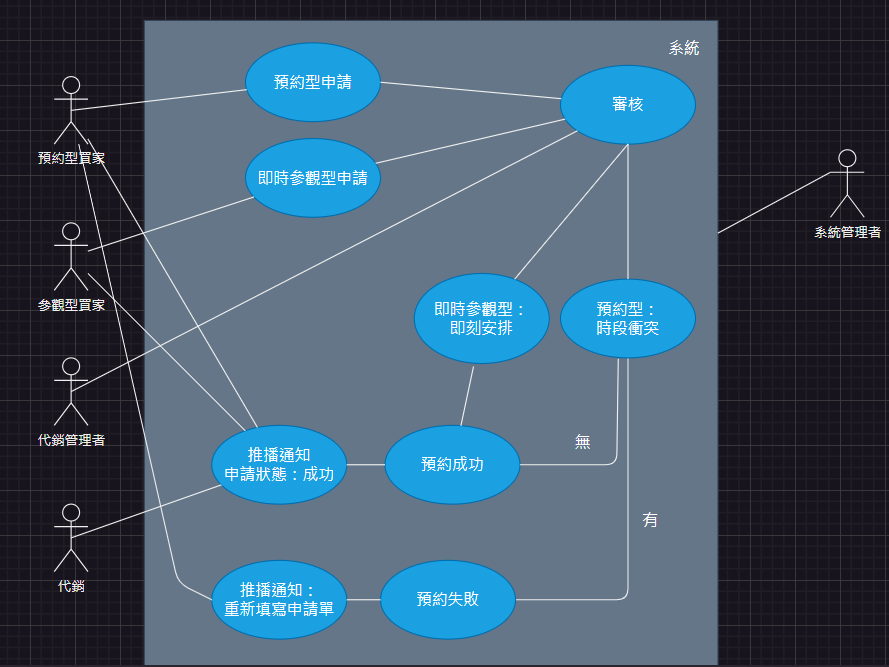
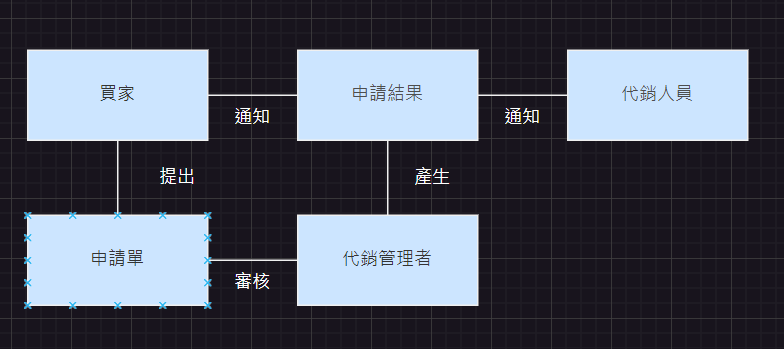
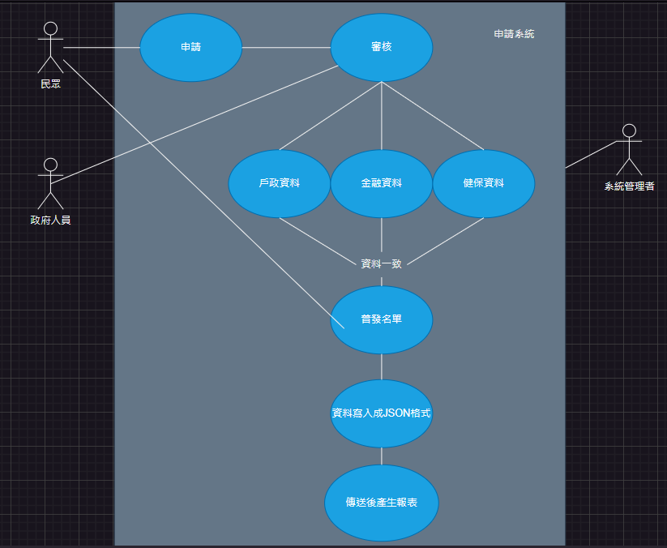
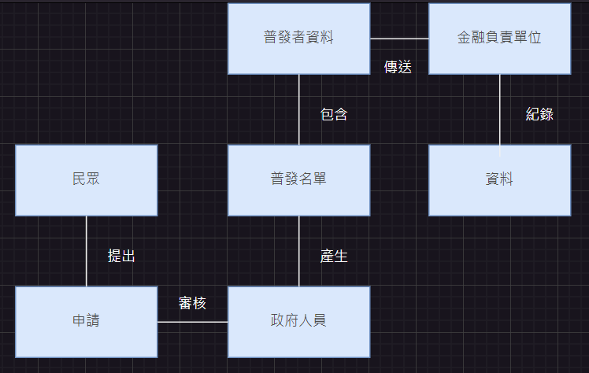

# 期中考-期中-Mid 
<!--(期中標籤註記，該行不能刪，作為驗證標籤，該檔案若沒該份標籤，代表直接貼上saample，直接0分)-->

>
>學號：111108116
> 
>姓名：吳亭誼
> 

本份文件包含以下主題：(至少需下面兩項，若是有多者可以自行新增)
- [x] 答題

## 答題
>1. 

(a)
1. 預約型買家：
．能加入Line公開頻道，點選預約制Line選單後進行身分填寫
．預約成功能收到Line推播通知
．預約失敗能收到Line推播通知重新填寫申請單

2. 現場即時參觀買家：
．能加入Line公開頻道，點選現場制Line選單後進行填寫
．預約成功能收到Line推播通知

3. 代銷管理者
．能進行申請審核、買家時程安排和時程安排後應安排哪位代銷作為接待人員

4. 代銷人員
．能收到買家的接待時段

======

1. 預約申請案例：
．買家到達接待中心前48小時進行填寫申請。填寫方式為打開Line後，搜尋本次建案名稱，並加入Line bot公開頻道，或是利用手機掃描QR CODE後加入Line bot公開頻道。
．進入頻道後，需先點選預約制Line選單後，再進行身分填寫，其內容需要有手機號碼、姓名與期望被接待的日期與時間，上述內容撰寫完畢並送出後，該申請將進入後台給代銷管理者進行審核。

2. 即時參觀申請：
．主要流程與預約型買家類似，唯一不同在於現場即時參觀買家在進入頻道後，須點選現場制Line選單後，再進行填寫，且填寫內容不能讓該買家選擇時段，剩下的步驟直至將該申請將進入後台給代銷管理者進行審核流程一致。

3. 審核申請：
．申請傳入後台上。若當有申請流入且尚未被安排者，需要將其按照申請的類別進行分別顯示。
．假設類別為預約型買家申請，則該申請可被單獨點選並查詢該時段時否有被選取，若沒有時段衝突，則將該筆申請安排代銷作為接待人員，並將該申請狀台轉為預約成功，並將成功訊息推送給預約買家進行Line訊息推播。
．若為預約型買家所選的時段皆無法預約成功，請將失敗訊息推送給預約買家進行Line訊息推播，並請該預約買家重新填寫申請單。
．假設類別為現場即時參觀買家申請，則需讓代銷管理者立即，並決定將派哪位閒置的代銷進行分配，當分配完後，將直接對已分配的申請推撥至相對的現場即時參觀買家。
．不管何種種類的買家，每位買家只會於系統中的買家資料中出現一次。

(b)

(c)

(d)

 

(a)
1. 民眾：
．能正確填寫網頁所需資料。
．能在填寫過程中修改資料。
．能在送出申請前出現確認頁。

2. 政府人員：
．能將申請者的身分證字號或居留證號與政府的第三方戶政系統進行連線，確認該申請者是否存在。
．能將申請者的身分證字號或居留證號傳至申請者所填的第三方金融機構進行比對資訊，看該金融帳戶是否為申請人。
．能將健保卡號與身分證字號或居留證號連線至第三方的健保局比對資料是否正確。
．能將合格申請者資料寫入成JSON格式(固定傳輸模式)。
．能將JSON格式傳送給金融負責單位後，在後台產生該次傳送的報表。

3. 系統管理者：
．能維護系統正常運作

======

1. 提出申請：
．進入申請網頁進行資料登記，內容包含身分證字號或居留證號、代領金融代號(以下拉式選單選擇)、申請人金融機構帳號與健保卡卡號。當申請人填妥後會有確認頁做最後一次確認後，若修改資訊則回到填入資訊該頁，若確認正確則直接送出。

2. 審核：
．政府機關人員可看到每日申請者資訊，包含：
(1)申請者的身分證字號或居留證號與政府的第三方戶政系統進行連線，確認該申請者是否存在。
(2)將申請者的身分證字號或居留證號傳至申請者所填的第三方金融機構進行比對資訊，看該金融帳戶是否為申請人
(3)健保卡號與身分證字號或居留證號連線至第三方的健保局比對資料是否正確

3. 申請通過：
．確認審核通過後，則該申請者則會出現在普發名單中，並讓政府人員將合格資料寫入成JSON格式(固定傳輸模式)，以便之後可以利用後台交給其他金融負責單位，並同時於傳送後，於本後台產生該次傳送的報表。

(b)

(c)

(d)
